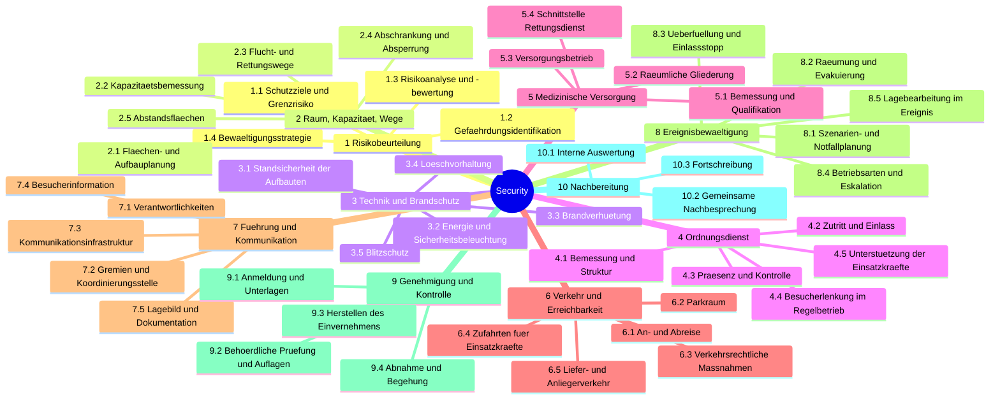

# Taxonomie der Security-Module

Zehn Modulgruppen mit je drei bis fünf Modulen, abgeleitet aus dem
Münchener Leitfaden Veranstaltungssicherheit. Die Taxonomie ordnet Tätigkeiten,
nicht Dokumente und nicht Rollen.

**Überführt.** Diese Datei ist die Quellenauswertung mit Belegstelle je Kapitel.
Der Arbeitsstand ist [modullandkarte-security-konsolidiert.md](modullandkarte-security-konsolidiert.md);
dort ist die Taxonomie auf den Security-Zuschnitt der Messe gebracht, mit den
Modularten und der Nummerierung. Die Überleitungstabelle dort weist nach, wohin
jede der zehn Gruppen gegangen ist.

## Gliederungsprinzip

Eine Ebene, eine Achse. Die Hierarchie gliedert ausschließlich nach dem
**Gegenstand, auf den die Leistung wirkt** — Raum, Personenstrom, Technik,
Verkehr, Information und so fort. Zwei weitere Unterscheidungen, die man
intuitiv mit hineinziehen möchte, sind bewusst **nicht** Teil der Hierarchie,
weil sie quer zu ihr liegen und sie sonst zerschneiden würden:

| Dimension | Werte | warum nicht in der Hierarchie |
|---|---|---|
| Phase | P0 bis P7 nach [phasen.md](../1_grundkonzepte/phasen.md) — nicht die fünf Phasen des Leitfadens | fast jede Modulgruppe wirkt in mehreren Phasen; das Mapping steht noch aus |
| Akteur | Veranstalter, Dienstleister, Genehmigungsbehörde, Gefahrenabwehr | dieselbe Leistung wird je nach Veranstalter-Modell anders besetzt (Kap. 2.3.) |

Jede konkrete Tätigkeit ist damit ein Tripel: Modul × Phase × Akteur. Beispiel:
*Einsatzplanung der Feuerwehr* = 8.1 Szenarien- und Notfallplanung × P2 ×
Gefahrenabwehr (Kap. 5.2.).

**Ebenengröße.** Ebene 1 ist so geschnitten, dass jede Modulgruppe eigenständig
beauftragbar oder zuständigkeitsfähig ist und ein eigenes Ergebnis hat. Ebene 2
ist so geschnitten, dass jedes Modul einzeln bemessen, besetzt und geprüft
werden kann. Die in den Tabellen genannten Einzelpunkte sind Beispiele, keine
dritte Ebene — Varianten sind hier noch nicht geführt.

## Mind-Map

Dieselbe Grafik im Browser: `taxonomie-security-leistungen.html`.

## 1 Risiko- und Sicherheitsbeurteilung

Erzeugt das Wissen, auf dem alle anderen Felder aufsetzen. Eigenständiges
Verfahren mit eigenem Ergebnis (bewertete Risiken, Maßnahmenplan), deshalb
eigene Gruppe und nicht Bestandteil der Fachgewerke.

| Nr. | Modul | umfasst | Beleg |
|---|---|---|---|
| 1.1 | Schutzziele und Grenzrisiko festlegen | Ziele der Veranstaltung, tolerierbares Risiko, Kalibrierung | Kap. 3.2.1.1., 3.2.1.2. |
| 1.2 | Gefährdungen identifizieren | Standardgefährdungen, typenspezifische Gefährdungen, Anschläge und Drohungen | Kap. 3.2.1.3. |
| 1.3 | Risiken analysieren und bewerten | Schadensschwere × Eintrittswahrscheinlichkeit, Risikomatrix, Abgleich mit dem Grenzrisiko | Kap. 3.2.1.4., 3.2.2. |
| 1.4 | Bewältigungsstrategie festlegen | Rangfolge Vermeidung / technisch / organisatorisch / verhaltensbezogen, Rückwirkung neuer Risiken | Kap. 3.2.3. |

## 2 Raumordnung, Kapazität und Wege

Alles, was die Fläche und ihre Belegung festlegt. Ergebnis sind Pläne und Zahlen.

| Nr. | Modul | umfasst | Beleg |
|---|---|---|---|
| 2.1 | Flächen- und Aufbauplanung | Aufbau-, Bestuhlungs-, Lageplan, Stauflächen, Vermeidung doppelter Flächenbelegung | Kap. 3.3.2.2.3., 3.3.2.2.8. |
| 2.2 | Kapazität bemessen | Personendichte, rechnerischer Rettungswegnachweis, Höchstbesucherzahl, Bereichszahlen | Kap. 3.3.2.2.8. |
| 2.3 | Flucht- und Rettungswege auslegen | Führung, Breiten, Kennzeichnung, Anforderungen besonderer Besuchergruppen, Wege angrenzender Gebäude | Kap. 3.3.2.2.8. |
| 2.4 | Abschrankung und Absperrung | Bühnenabschrankung, Wellenbrecher, Gittertypen, Ordner- und Sanitätsgang | Kap. 3.3.2.2.8., Anlage 1 |
| 2.5 | Abstandsflächen festlegen | Abstände zur Nachbarbebauung und zwischen Aufbauten, Kompensationen | Kap. 3.3.2.2.9. |

## 3 Technische und brandschutztechnische Sicherheit

Sicherheit der Sachen: Aufbauten, Anlagen, Stoffe. Abgegrenzt gegen Gruppe 2 —
dort geht es um Lage und Maß im Raum, hier um Beschaffenheit und Betrieb.

| Nr. | Modul | umfasst | Beleg |
|---|---|---|---|
| 3.1 | Standsicherheit der Aufbauten | Fliegende Bauten, Zelte, Tribünen, Rigg und Tower, Wetterlasten, verantwortlicher Veranstaltungstechniker | Kap. 3.3.2.2.6., Anlagen 6a, 6h |
| 3.2 | Energie und Sicherheitsbeleuchtung | Stromversorgung, Notstrom, Sicherheitsbeleuchtung, Beschallungs- und Warnanlagen als Anlage | Kap. 3.3.2.2.10., 4.3. |
| 3.3 | Brandverhütung | Brandverhalten von Materialien, offenes Feuer, Pyrotechnik des Veranstalters, brennbare Flüssigkeiten und Gase | Kap. 3.3.2.2.14., Anlagen 6b–6f, 6l |
| 3.4 | Löschvorhaltung und Brandsicherheitswache | Löschgeräte und -mittel, Löschwasserversorgung, Hydrantenfreihaltung, Brandsicherheitswache | Kap. 3.3.2.2.14., 5.2. |
| 3.5 | Blitzschutz | Maßnahmen an Tower, Bühnen, Videowänden, Sicherheitseinrichtungen | Kap. 3.3.2.2.14. |

## 4 Ordnungsdienstliche Leistungen

Leistungen am Besucher im Regelbetrieb. Ereignisbezogenes Handeln steht in
Gruppe 8; der Ordnungsdienst führt es aus, geplant wird es dort.

| Nr. | Modul | umfasst | Beleg |
|---|---|---|---|
| 4.1 | Bemessung und Struktur | Stärke nach Gefährdungspotenzial, Postenplan, Dienstzeiten, Organigramm, Qualifikation, Erkennbarkeit, Ausstattung, Einweisung | Kap. 3.3.2.2.15. |
| 4.2 | Zutritt und Einlass | Einlasskonzept, Zugangskontrolle, Taschenkontrolle, Kontrolle der Bereichszugänge | Kap. 3.3.2.2.15. |
| 4.3 | Präsenz und Kontrolle | Streifengänge, Absicherung des Geländes, Freihaltung der Flucht- und Rettungswege, Durchsetzung von Verboten | Kap. 3.3.2.2.15. |
| 4.4 | Besucherlenkung im Regelbetrieb | Personenlenkung, Bühnenabsicherung, Überwachung der Personendichte, Besucherinformation vor Ort | Kap. 3.3.2.2.8., 3.3.2.2.15. |
| 4.5 | Unterstützung der Einsatzkräfte | Alarmierung und Einweisung, Absperren, Öffnen von Rettungswegen, Eskortierung, Bewachung von Einsatzfahrzeugen | Kap. 3.3.2.2.15. |

## 5 Medizinische Versorgung

| Nr. | Modul | umfasst | Beleg |
|---|---|---|---|
| 5.1 | Bemessung und Qualifikation | Punktwert, Risikomultiplikator, Zuschläge, Stärke und Qualifikationsstufen, Wetterrisiko | Kap. 3.3.2.2.16. |
| 5.2 | Räumliche Gliederung | Einsatzabschnitte, Unfallhilfsstellen ortsfest und mobil, Hilfsfristen | Kap. 3.3.2.2.16. |
| 5.3 | Versorgungsbetrieb | erweiterte Erste Hilfe, Bagatellversorgung, Erstversorgungsteams, Dokumentation der Versorgung | Kap. 3.3.2.2.16. |
| 5.4 | Schnittstelle Rettungsdienst | Alarmierung und Einweisung, Vorhalteerhöhung, Krankenhauseinbindung, MANV-Vorplanung | Kap. 5.3. |

## 6 Verkehr und Erreichbarkeit

| Nr. | Modul | umfasst | Beleg |
|---|---|---|---|
| 6.1 | An- und Abreise steuern | Modal Split, ÖPNV, Shuttle, Fußgänger- und Radverkehr, Leitsysteme, Rückstau am Einlass | Kap. 3.3.2.2.13. |
| 6.2 | Parkraum planen und betreiben | Stellplatzbedarf und -bilanz, Aufstellung und Befüllung, Parkleitsystem, Sonderbereiche, Haltebereiche | Kap. 3.3.2.2.13. |
| 6.3 | Verkehrsrechtliche Maßnahmen | Sperrungen, Halteverbote mit Zusatz Rettungsweg, verkehrliche Anordnungen, Durchsetzung und Abschleppen | Kap. 3.3.2.2.13. |
| 6.4 | Zufahrten für Einsatzkräfte | Zu- und Umfahrten, Aufstell- und Bewegungsflächen, 50-Meter-Annäherung, Trennung von den Fluchtwegen, Ausrücken der Wachen | Kap. 3.3.2.2.13., 5.2. |
| 6.5 | Liefer- und Anliegerverkehr | Lieferwege und -zeiten getrennt vom Betrieb, Zufahrt der Anlieger, Vorabinformation der Betroffenen | Kap. 3.3.2.2.13. |

## 7 Führung, Gremien und Kommunikation

Ordnet Zuständigkeit und Informationsfluss. Gegenstand ist nicht der Besucher
und nicht die Fläche, sondern die Organisation selbst.

| Nr. | Modul | umfasst | Beleg |
|---|---|---|---|
| 7.1 | Verantwortlichkeiten festlegen | Veranstalter, beauftragter Veranstaltungsleiter, Ordnungsdienstleiter, Leiter Sanitätsdienst, Veranstaltungstechniker, Behördenansprechpartner | Kap. 3.3.2.2.6. |
| 7.2 | Gremien und Koordinierungsstelle | Sicherheitskreis, Koordinierungskreis, Besetzung, Einberufung und Fristen, Raum und Ausstattung der KooSt | Kap. 3.3.2.2.7. |
| 7.3 | Kommunikationsinfrastruktur | Kommunikationsliste, zwei unabhängige Wege je Schlüsselperson, Betriebsfunk, Prüfung vor Beginn, Notrufmöglichkeit ohne Mobiltelefon | Kap. 3.3.2.2.7., 6.2.2. |
| 7.4 | Besucherinformation | Sicherheitsdurchsagen und Textbausteine, Mehrsprachigkeit, Zwei-Sinne-Prinzip, Videowände, Orientierungssystematik im Gelände, Medienarbeit | Kap. 3.3.2.2.8., 3.3.2.2.10., 6.2.5. |
| 7.5 | Lagebild und Dokumentation | Informationsgewinnung aus Leitstellen, Posten, Monitoring, Wetter- und Verkehrswarnungen, sozialen Medien; Einsatz- und Entscheidungsprotokolle | Kap. 6.2.1., 6.2.6. |

## 8 Ereignis- und Krisenbewältigung

Verknüpft Auslöser, Maßnahme, Verantwortlichkeit und Kommunikation. Die
einzelne Maßnahme gehört dem Fachgewerk, das sie ausführt; die Verknüpfung
gehört hierher.

| Nr. | Modul | umfasst | Beleg |
|---|---|---|---|
| 8.1 | Szenarien- und Notfallplanung | je Gefährdung: Maßnahmen, Reihenfolge, Wer macht was wann, Informationsempfänger; Einsatzplanungen der Behörden als deren Gegenstück | Kap. 3.3.2.2.10., 5. |
| 8.2 | Räumung und Evakuierung | Verantwortlichkeiten, Aufgabenverteilung, zeitlicher Ablauf, Räumungsdurchsagen, Teilräumung | Kap. 3.3.2.2.11. |
| 8.3 | Überfüllung und Einlasssteuerung | füllgradabhängige Maßnahmen, Einlassstopp, Vorsperren, Umleitungsstrecken, erforderliche Ordnerkräfte | Kap. 3.3.2.2.12. |
| 8.4 | Betriebsarten und Eskalation | Regelbetrieb, abstimmungsbedürftiges Ereignis, Schadensfall; Zuständigkeitswechsel und Übergabe an die Einsatzleitung | Kap. 6.1. |
| 8.5 | Lagebearbeitung im Ereignis | Informationsweitergabe, Beurteilung der Lage, Entschlussfassung, Umsetzung und Rückmeldung | Kap. 6.2. |

## 9 Genehmigung, Nachweis und Kontrolle

| Nr. | Modul | umfasst | Beleg |
|---|---|---|---|
| 9.1 | Anmeldung und Unterlagen | Anzeige oder Antrag, Veranstaltungsbeschreibung, Pläne, Besucherzahlen, Vollständigkeit und Fristen | Kap. 4.1. |
| 9.2 | Behördliche Prüfung und Auflagen | Prüfkatalog, Risikoeinteilung und Sicherheitskoeffizient, Abweichungen und Nachweis gleicher Sicherheit, Bescheid und Auflagen | Kap. 3.2.4., 4.3., 4.5., Anlagen 2, 4 |
| 9.3 | Herstellen des Einvernehmens | Abstimmung des Sicherheitskonzepts mit Polizei, Feuerwehr, Rettungsdienst und Sicherheitsbehörde, Versionsschleifen, Einheitlicher Ansprechpartner | Kap. 3.3.3., 4.4., Anlage 5 |
| 9.4 | Abnahme und Begehung | Begehung vor Beginn, Begehungen im Betrieb, Kontrolle der Auflagen und der Planübereinstimmung, Mängelabstellung | Kap. 6. |

## 10 Nachbereitung und Fortschreibung

| Nr. | Modul | umfasst | Beleg |
|---|---|---|---|
| 10.1 | Interne Auswertung | Erfahrungsbericht je Organisation, eigene Themensetzung | Kap. 7.1. |
| 10.2 | Gemeinsame Nachbesprechung | organisationsübergreifende Auswertung, Schwachstellen im Sicherheitskonzept, Fehlermelde- und Verbesserungssystem, menschlicher Faktor | Kap. 7.1. |
| 10.3 | Fortschreibung | Dokumentation und Verteilung der Ergebnisse, Anpassung von Konzept, Auflagen, Einsatzplanung und Risikoeinstufung, Besuchertendenz | Kap. 7.1., 7.2. |

## Wo die Trennschärfe nicht aufgeht

Sechs Stellen, an denen sich Leistungen nicht überschneidungsfrei zuordnen
lassen. Jeweils mit der Regel, nach der hier entschieden wurde.

| Stelle | Konflikt | Regel |
|---|---|---|
| Abstandsflächen | Schutzziel ist Brandausbreitung (3), umgesetzt wird im Plan (2) | Zuordnung nach dem Ort der Umsetzung → 2.5; das Bemessungsmaß kommt aus 3.3 |
| Zufahrten und Aufstellflächen | zugleich Raumordnung (2) und Verkehrsführung (6) | Zuordnung nach der Durchsetzung, die verkehrsrechtlich erfolgt → 6.4 |
| Überfüllung | laufende Dichteüberwachung (4.4) und Maßnahmen bei Überschreitung (8.3) | Trennung an der Schwelle Regelbetrieb / Abweichung; die Schwelle selbst ist fließend |
| Räumung | geplant in 8.2, ausgeführt vom Ordnungsdienst (4) | Planungsleistung getrennt von Ausführungsleistung; dieselbe Regel gilt für alle Szenarien |
| Sicherheitsdurchsagen | Infrastruktur und Textbausteine (7.4), Auslösung im Ereignis (8.5) | Vorhalten in Gruppe 7, Auslösen in Gruppe 8 |
| Risikobeurteilung | liefert Input für alle Gruppen und wirkt dadurch wie ein Querschnitt | eigene Gruppe, weil eigener Ablauf und eigenes Ergebnis; Anwendung des Ergebnisses gehört der jeweiligen Gruppe |

Zwei weitere Punkte, die keine Überlappung sind, aber die Lesart betreffen:

- **Das Sicherheitskonzept ist keine Kategorie.** Es ist das Dokument, in dem
  die Ergebnisse der Gruppen 1 bis 8 zusammenlaufen (Kap. 3.3.2.). Es taucht
  deshalb in der Taxonomie nicht als Modulgruppe auf, sondern als Ausgabe.
- **Der Ordnungsdienst erbringt auch Nicht-Security-Leistungen.** Der Leitfaden
  trennt Ordnungsaufgaben (Platzanweisung, allgemeine Besucherinformation) von
  Sicherheitsaufgaben (Kap. 3.3.2.2.15.). Gruppe 4 umfasst hier nur die
  Sicherheitsaufgaben; die Ordnungsaufgaben laufen personell mit, gehören
  fachlich aber nicht in diese Taxonomie.

## Was die Quelle nicht abdeckt

Die Taxonomie ist vollständig gegenüber dem Leitfaden, nicht gegenüber dem
Sicherheitsbegriff eines Messebetriebs. Der Leitfaden behandelt die
Einzelveranstaltung aus Sicht der Gefahrenabwehr. Nicht enthalten und damit
auch hier nicht abgebildet:

- Objekt- und Werkschutz außerhalb der Veranstaltungszeit
- Arbeitsschutz der Auf- und Abbaukräfte
- Informations- und IT-Sicherheit, Zutrittssysteme als Datenverarbeitung
- Sicherheit im Verhältnis zu Ausstellern und deren Standbau
- Vertrags- und Haftungsfragen der Sicherheitsdienstleistung

Ob diese Felder ergänzt werden, ist eine Entscheidung — kein Ableitungsschritt
aus dieser Quelle.
